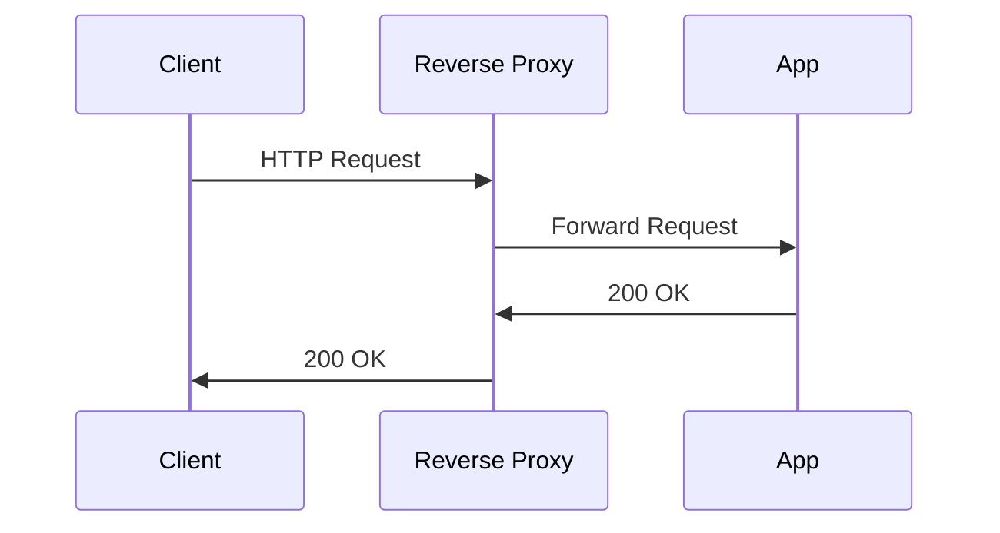
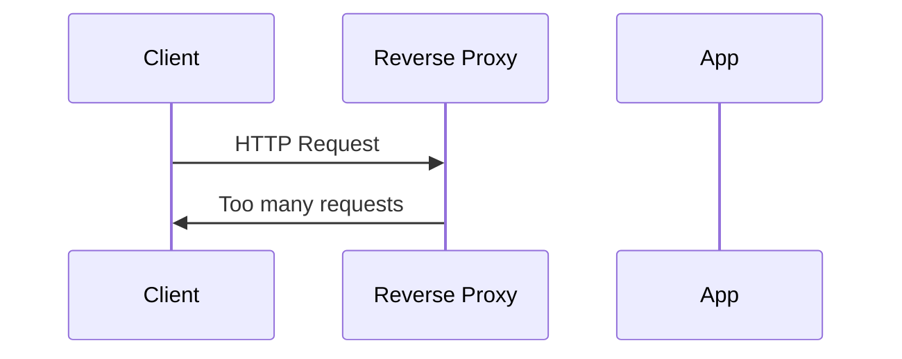

Rate limiting an API is required for several reasons.

A single service serves calls from many clients. We want to make sure that the calls from clients are served fairly and one client doesn't consume all the app resources. Too many requests in a short period of time can overwhelm the service by consuming too much CPU or memory. Another reason why we might want to limit a client is when they used up all their allocated credits.

Someone could mount a brute force attack on the service by making a large number of calls in a short period of time. Having a rate limit can mitigate such attacks, with some caveats, that we will discuss below.

Without rate limiting, the reverse proxy will route the request to the app.

With rate limiting, if the rate limit has been exceeded by the client, the reverse proxy will block the requests.


We can demo rate limit by creating a service using python that will listen on port 8001. We are going to put a nginx reverse proxy infront of the service and add rate limit directive. Lets start with the nginx config. This is the config that we are going to use.

```bash {hl_lines=["1", "11"]}
limit_req_zone $binary_remote_addr zone=mylimit:10m rate=2r/s;

upstream demo {
    server 127.0.0.1:8001;
}

server {
    listen 80 default_server;

    location / {
        limit_req zone=mylimit;
        proxy_pass http://demo;
    }
}
```

The `rate` paramter in `limit_req_zone` directive is setting the rate limit of 2 requests per second. This is for demonstrative purposes only. The real systems can serve requests many orders of magnitude more than 2 per second.

I am going to use `hey`, a load testing tool, to send 4 requests in 1 second.
```bash
hey -n 4 -q 4 -c 1 http://localhost | grep -e 200 -e 503
```
In the above command `-n` sets the total number of requests to send. `-q` sets queries per second per worker and `-c` sets the number of workers. We then grep for response codes `200` and `503`.
<figure>

<figcaption>Bottom: service listening on port 8001, Middle: making requests to service, Top: nginx error logs </figcaption>
</figure>

Notice how two requests got a 200 response and two got rejected. Also notice that the error log stored the log messages for the blocked requests. The error log is stored at `/var/log/ngix/error.log`.

 The 503 response for sending too many requests is outdated. Instead of 503, the reverse proxy should return 429 response. We can fix the config to do just that by adding `limit_req_status 429;` under `location` block.

```bash {hl_lines=["12"]}
limit_req_zone $binary_remote_addr zone=mylimit:10m rate=2r/s;

upstream demo {
    server 127.0.0.1:8001;
}

server {
    listen 80 default_server;

    location / {
        limit_req zone=mylimit;
        limit_req_status 429;
        proxy_pass http://demo;
    }
}
```

Lets run this again and see what happens.


As you can see here, the blocked responses have response codes as 429 instead of 503.

We might want to allow some requests to be served even though those requests are violating the rate limit to account for bursty traffic. We set burst parameter to 8 in `limit_req` directive. Nginx will create a queue of such requests to serve.

```bash {hl_lines=["11"]}
limit_req_zone $binary_remote_addr zone=mylimit:10m rate=2r/s;

upstream demo {
    server 127.0.0.1:8001;
}

server {
    listen 80 default_server;

    location / {
        limit_req zone=mylimit burst=8;
        limit_req_status 429;
        proxy_pass http://demo;
    }
}
```

We are now going to send 15 requests in one second with `hey -n 15 -q 15 -c 1 http://localhost`.



Notice how these requests were delayed a bit, however, all the requests received a 200 response. This is because the incoming requests were put in a queue and then served slowly. If you want to enforce the behavior where you would like to serve the original rate limit and an additional number of requests specified in the burst, use `nodelay` param with `limit_req` directive.

```bash {hl_lines=["11"]}
limit_req_zone $binary_remote_addr zone=mylimit:10m rate=2r/s;

upstream demo {
    server 127.0.0.1:8001;
}

server {
    listen 80 default_server;

    location / {
        limit_req zone=mylimit burst=8 nodelay;
        limit_req_status 429;
        proxy_pass http://demo;
    }
}
```

Lets run the same experiment again. This time the requests should be served without delay.



Notice how the first 2 requests got processed with the `2r/s` quota, then 8 more also got processed under `burst=8` and then the 5 remaining got blocked.

One thing that I want to clarify is that rate limiting is not the complete solution for denial of service. This is because some requests can be made in such a way that it takes really long time for those requests to get processed. Since the above nginx config is only counting the number of requests per second, small number of time-consuming requests can still cause denial of service.

