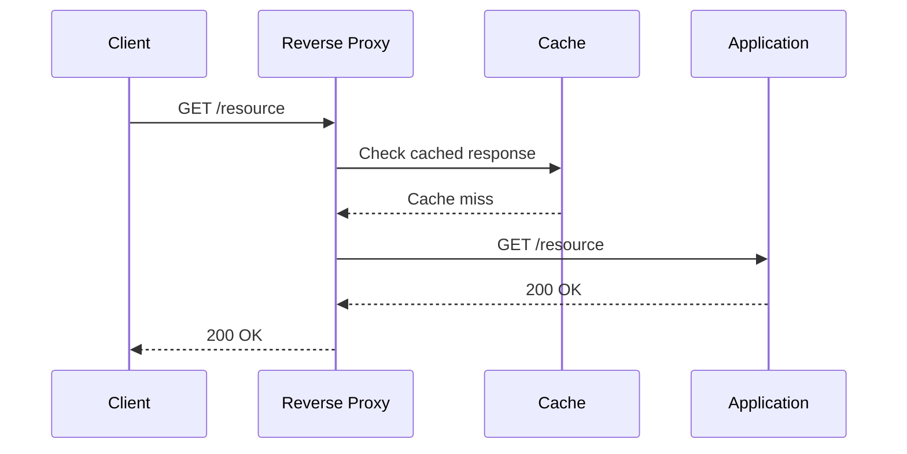
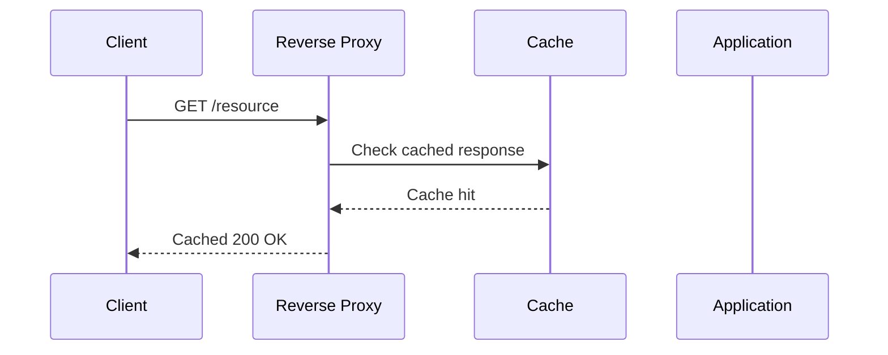
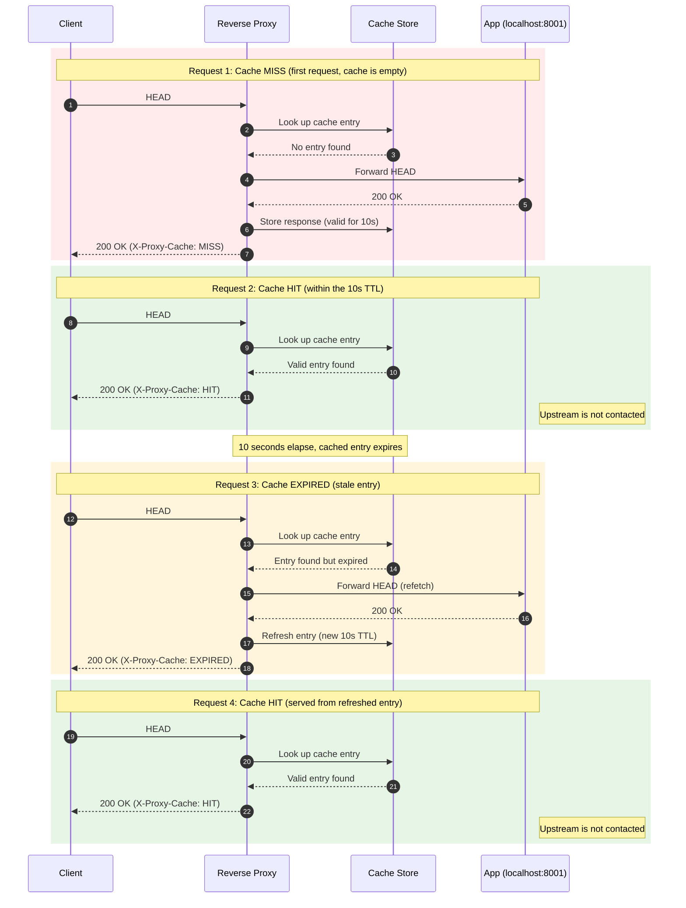

Server side caching can be implemented via reverse proxy such as nginx. Caching allows the traffic to be served faster and also reduces the load on the app. In this post, I am going to demonstrate the server-side caching using a server and an nginx reverse proxy running locally.

Lets talk about what cache miss and cache hit mean. 

**Cache Miss**

This is when a reverse proxy receives a request and can't find the response in the cache. In such cases, the request is forwarded to the origin server and reverse proxy stores the response in cache.

This is what a cache miss looks like.



**Cache Hit**

This is when a reverse proxy receives a request and serves it from the cache. No contact with the origin takes place.

This is a cache hit.



We are going to use this nginx config.

```bash {hl_lines=["1"]}
proxy_cache_path /tmp/nginx_cache levels=1:2 keys_zone=demo_cache:10m max_size=1g inactive=60m use_temp_path=off;

upstream demo {
    server 127.0.0.1:8001;
}

server {
    listen 80;

    location / {
        proxy_pass http://demo;

        proxy_cache demo_cache;
        proxy_cache_valid 200 10m;

        add_header X-Proxy-Cache $upstream_cache_status;
    }
}
```
The cache is being stored in `/tmp/nginx_cache` on local disk. The cache TTL (time to live) is set to 10 minutes and nginx is set to return the cache status to the caller under `X-Proxy-Cache` header.

Once the nginx is running with this config, we start a server with:
```bash
python3 -m http.server 8001
```

I will send a curl request. 

```bash
curl -v http://localhost
```

There will be a cache miss and reverse proxy will route the request to the app and will add `X-Proxy-Cache: MISS` in the response. The reverse proxy however is going to store the response in the cache for the next time when the client calls the same endpoint. When we send the curl request again, the reverse proxy responds with the data stored in the cache. See the video below.



Notice how at `00:07` mark in the bottom pane when curl request was sent the second time the app didn't report a 200 since the request was served from the cache as opposed to the first curl request at `00:03` when the data was not in cache.

Another thing to notice in the config is `proxy_cache_valid` directive. The TTL (time to live) is set to `10m`. Lets reduce it to 10s in order to test cache expiry. 

```bash {hl_lines=["14"]}
proxy_cache_path /tmp/nginx_cache levels=1:2 keys_zone=demo_cache:10m max_size=1g inactive=60m use_temp_path=off;

upstream demo {
    server 127.0.0.1:8001;
}

server {
    listen 80;

    location / {
        proxy_pass http://demo;

        proxy_cache demo_cache;
        proxy_cache_valid 200 10s;

        add_header X-Proxy-Cache $upstream_cache_status;
    }
}
```

Lets send two curl requests in quick succession and see the request being served by the app and then from the cache. Wait about 10 seconds and send the request the third time. This time the request is served from the app and the `X-Proxy-Cache` header reads `EXPIRED`. When the curl request is sent the fourth time, the request is served from the cache.



On a sequence diagram, this is how the requests in the video are going to look like.



`X-Proxy-Cache` header allows developers to verify the performance of the app. By monitoring this header in the response, developers can see how much traffic is getting served by the cache.